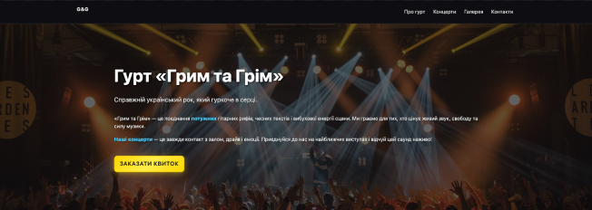
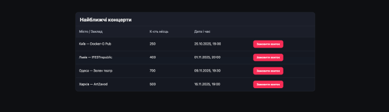
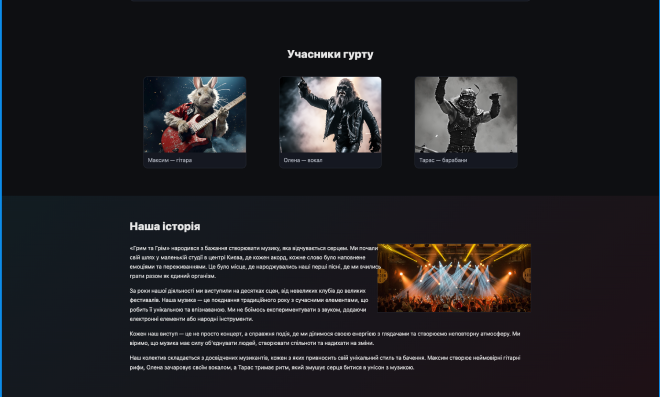
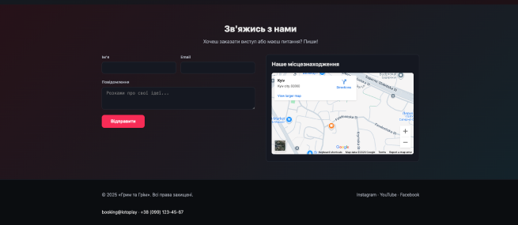

# Band website

## 💼 Project Overview:

**Band website** is a music band "Грим та Грім" page, for tracking tours,
ordering tickets, getting to know the band members, and providing feedback and
suggestions.

## 🛠 Tech Stack:

- **HTML** - the basis of a web page structure that allows you to create
  semantic blocks, shape content, and maintain accessibility

- **CSS Modules** — a method of organizing styles that provides local scope for
  classes, preventing conflicts and making code maintenance more convenient and
  predictable

- **JavaScript** - a programming language for dynamically updating content,
  handling events, and interacting with the user, which adds functionality and
  interactivity to web applications

## 🚀 Quick Start:

Follow these steps to set up and run the project locally:

Clone the repository:

git clone https://github.com/Myrosya-fsd/band-website Navigate to the project
directory:

Navigate to the project directory: cd band-website

npm install Start the development server:

npm run dev Access the application: Open your browser and navigate to
http://localhost:5173

📷 Screenshot:

🏠 Home page: 

⭐ tracking tours: 

👩‍🏫 interacting with the band: 

💼 providing feedback and suggestions: 

👨‍💻 Author: Developed by Myroslava Havrylchuk 📧 Email:
myroslavahavrylchuk@gmail.com 🔗 GitHub: Myrosya-fsd
